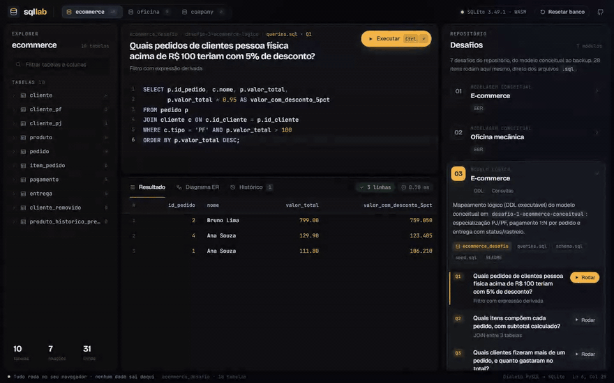
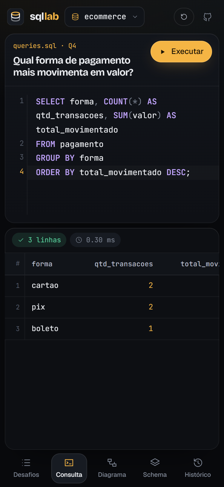

# SQL Lab

Modelagem e SQL de dois domínios de negócio (e-commerce e oficina mecânica), do diagrama conceitual ao backup, com um playground que executa os scripts do repositório direto no navegador.

**[Ver ao vivo →](https://leandromlmoreira.github.io/sql-lab/)**

[](https://leandromlmoreira.github.io/sql-lab/)

<p align="center">
  
  
</p>

## Funcionalidades do playground

- **Três bancos reais** (`ecommerce_desafio`, `oficina_desafio`, `company_desafio`) montados em memória a partir dos `schema.sql`, `seed.sql`, views e triggers deste repositório. Nada é copiado à mão: o front importa os arquivos `.sql` e os READMEs no build.
- **Editor SQL** com numeração de linhas, destaque de sintaxe, autocomplete de palavras-chave, tabelas e colunas do banco carregado, e `Ctrl+Enter` / `⌘+Enter` para executar (ou só o trecho selecionado).
- **Grade de resultados** com ordenação por coluna, contagem de linhas, tempo de execução, múltiplos conjuntos de resultado e estados de carregamento, vazio e erro com dica do que corrigir.
- **Diagrama ER interativo** em SVG: tabelas arrastáveis com mouse ou toque, zoom e pan, e destaque das chaves estrangeiras ao passar o mouse ou tocar numa tabela.
- **Desafios 1 a 7** com a pergunta de negócio de cada consulta, índices com `EXPLAIN QUERY PLAN`, views, demonstrações de trigger e de transação, e as procedures/permissões do MySQL como referência com a saída registrada.
- **Explorer de schema** com tipos, PK/FK e atalho para abrir qualquer tabela.
- **Histórico** das consultas executadas, salvo no navegador e reabrível com um clique.
- **Tradução MySQL → SQLite na hora**: `ENUM`, `AUTO_INCREMENT`, `DATEDIFF`, `CONCAT`, `START TRANSACTION`, variáveis `@x`, `IF` dentro de trigger e `ALTER TABLE ... FOREIGN KEY` são adaptados sem alterar os scripts originais.
- Layout responsivo: no celular os painéis viram abas.

## O que tem aqui

| Módulo | Conteúdo |
|---|---|
| [Modelagem conceitual — E-commerce](desafio-1-ecommerce-conceitual/) | Especialização PJ/PF, pagamento 1:N, entrega com status/rastreio — modelo EER + justificativas |
| [Modelagem conceitual — Oficina mecânica](desafio-2-oficina-conceitual/) | Modelo EER completo: OS, equipe de mecânicos (N:M), serviços e peças |
| [Modelo lógico — E-commerce](desafio-3-ecommerce-logico/) | DDL + seed + 7 consultas com as perguntas de negócio que respondem |
| [Modelo lógico — Oficina mecânica](desafio-4-oficina-logico/) | DDL + seed + 6 consultas para o domínio de OS/oficina |
| [Índices e procedures (schema COMPANY)](desafio-5-indices-procedures/) | 5 índices justificados + procedure CRUD parametrizada com `CASE`/`IF` |
| [Views, permissões e triggers](desafio-6-views-triggers-permissoes/) | 5 views + usuários com acesso diferenciado (testado de verdade) + 2 triggers de automação |
| [Transações, backup e recovery](desafio-7-transacoes-backup/) | Transação simples, procedure com `SAVEPOINT`/`ROLLBACK` total e parcial, backup com `mysqldump` e recovery testado |

Todo o SQL foi **executado e validado** contra uma instância MySQL 8.4, não apenas escrito.

## Stack

- **SQL:** MySQL 8.4 (`ENUM`, `AUTO_INCREMENT`, procedures com `DELIMITER`, `SIGNAL`/`SAVEPOINT`, `CREATE USER`/`GRANT`).
- **Playground:** Vite, TypeScript e Preact; SQLite compilado para WebAssembly com `sql.js`; CodeMirror 6 no editor; diagrama ER em SVG próprio. Deploy no GitHub Pages via GitHub Actions.

O playground roda em SQLite só para funcionar no navegador sem servidor. Procedures, `CALL` e `GRANT` não existem no SQLite: aparecem nos cards como referência, com o código e a saída registrada no MySQL.

## Como rodar

### Playground

```bash
cd web
npm install
npm run dev
```

`npm run build` gera o site estático em `web/dist`.

### Scripts no MySQL

Cada módulo lógico (3, 4, 5) cria seu próprio schema com `CREATE DATABASE`. Os módulos 6 e 7 reaproveitam schemas criados antes, então a ordem importa:

```bash
# Módulo 3 — cria ecommerce_desafio (usado nos módulos 6 e 7)
mysql -u root < desafio-3-ecommerce-logico/schema.sql
mysql -u root < desafio-3-ecommerce-logico/seed.sql

# Módulo 4 — cria oficina_desafio, independente
mysql -u root < desafio-4-oficina-logico/schema.sql
mysql -u root < desafio-4-oficina-logico/seed.sql

# Módulo 5 — cria company_desafio (usado no módulo 6)
mysql -u root < desafio-5-indices-procedures/schema.sql
mysql -u root < desafio-5-indices-procedures/seed.sql
mysql -u root < desafio-5-indices-procedures/procedure.sql

# Módulo 6 — views/permissões em company_desafio, triggers em ecommerce_desafio
mysql -u root < desafio-6-views-triggers-permissoes/views.sql
mysql -u root < desafio-6-views-triggers-permissoes/permissoes.sql
mysql -u root < desafio-6-views-triggers-permissoes/triggers.sql

# Módulo 7 — transações + backup/recovery em ecommerce_desafio
mysql -u root < desafio-7-transacoes-backup/transacao_simples.sql
mysql -u root < desafio-7-transacoes-backup/procedure_transacao.sql
```

Ajuste usuário, host e porta conforme sua instância. Os módulos 1 e 2 são conceituais (README + diagrama Mermaid), sem SQL executável.

---

<sub>Base: desafios de projeto da trilha Formação SQL Database Specialist (DIO).</sub>
