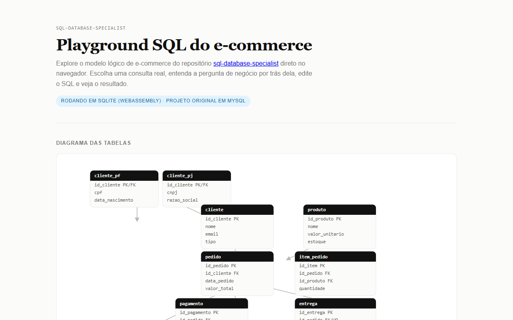

# SQL Database Specialist

[Ver ao vivo](https://leandromlmoreira.github.io/sql-database-specialist/) — playground SQL do módulo de e-commerce, rodando no navegador.

[](https://leandromlmoreira.github.io/sql-database-specialist/)

Coleção de modelagens e consultas SQL para dois domínios de negócio — **e-commerce** e **oficina mecânica** — cobrindo desde a modelagem conceitual até indexação, controle de acesso, automação com triggers, transações e backup/recovery em MySQL.

Todo o SQL foi **executado e validado** contra uma instância local MySQL 8.4, não apenas escrito.

## O que tem aqui

| Módulo | Conteúdo |
|---|---|
| [Modelagem conceitual — E-commerce](desafio-1-ecommerce-conceitual/) | Especialização PJ/PF, pagamento 1:N, entrega com status/rastreio — modelo EER + justificativas |
| [Modelagem conceitual — Oficina mecânica](desafio-2-oficina-conceitual/) | Modelo EER completo: OS, equipe de mecânicos (N:M), serviços e peças |
| [Modelo lógico — E-commerce](desafio-3-ecommerce-logico/) | DDL + seed + queries (JOIN, HAVING, expressões derivadas, perguntas de negócio) |
| [Modelo lógico — Oficina mecânica](desafio-4-oficina-logico/) | DDL + seed + queries para o domínio de OS/oficina |
| [Índices e procedures (schema COMPANY)](desafio-5-indices-procedures/) | 5 índices justificados + procedure CRUD parametrizada com `CASE`/`IF` |
| [Views, permissões e triggers](desafio-6-views-triggers-permissoes/) | 5 views + usuários com acesso diferenciado (testado de verdade) + 2 triggers de automação |
| [Transações, backup e recovery](desafio-7-transacoes-backup/) | Transação simples, procedure com `SAVEPOINT`/`ROLLBACK` total e parcial, backup com `mysqldump` e recovery testado (drop + restore) |

## Exemplo

Consulta que cruza pedidos e pagamentos para responder qual forma de pagamento mais movimenta em valor (de [`desafio-3-ecommerce-logico/queries.sql`](desafio-3-ecommerce-logico/queries.sql)):

```sql
SELECT forma, COUNT(*) AS qtd_transacoes, SUM(valor) AS total_movimentado
FROM pagamento
GROUP BY forma
ORDER BY total_movimentado DESC;
```

Resultado:

| forma  | qtd_transacoes | total_movimentado |
|--------|----------------|--------------------|
| cartao | 2              | 1099.00            |
| pix    | 2              | 241.70             |
| boleto | 1              | 119.80             |

## Stack

MySQL 8.4 (todos os scripts usam sintaxe padrão MySQL: `ENUM`, `AUTO_INCREMENT`, procedures com `DELIMITER`, `SIGNAL`/`SAVEPOINT`, `CREATE USER`/`GRANT`).

## Como rodar

Cada módulo lógico (3, 4, 5) cria seu próprio schema com `CREATE DATABASE`. Os módulos 6 e 7 reaproveitam schemas criados por módulos anteriores, então a ordem de execução importa:

```bash
# Módulo 3 — cria ecommerce_desafio (usado nos módulos 6 e 7)
mysql -u root --port=3307 --protocol=TCP < desafio-3-ecommerce-logico/schema.sql
mysql -u root --port=3307 --protocol=TCP < desafio-3-ecommerce-logico/seed.sql

# Módulo 4 — cria oficina_desafio, independente
mysql -u root --port=3307 --protocol=TCP < desafio-4-oficina-logico/schema.sql
mysql -u root --port=3307 --protocol=TCP < desafio-4-oficina-logico/seed.sql

# Módulo 5 — cria company_desafio (usado no módulo 6)
mysql -u root --port=3307 --protocol=TCP < desafio-5-indices-procedures/schema.sql
mysql -u root --port=3307 --protocol=TCP < desafio-5-indices-procedures/seed.sql
mysql -u root --port=3307 --protocol=TCP < desafio-5-indices-procedures/procedure.sql

# Módulo 6 — views/permissões em company_desafio, triggers em ecommerce_desafio
mysql -u root --port=3307 --protocol=TCP < desafio-6-views-triggers-permissoes/views.sql
mysql -u root --port=3307 --protocol=TCP < desafio-6-views-triggers-permissoes/permissoes.sql
mysql -u root --port=3307 --protocol=TCP < desafio-6-views-triggers-permissoes/triggers.sql

# Módulo 7 — transações + backup/recovery em ecommerce_desafio
mysql -u root --port=3307 --protocol=TCP < desafio-7-transacoes-backup/transacao_simples.sql
mysql -u root --port=3307 --protocol=TCP < desafio-7-transacoes-backup/procedure_transacao.sql
```

Ajuste `--port`/host conforme sua instância MySQL local. Os módulos 1 e 2 são conceituais (README + diagrama Mermaid), sem SQL executável.

## Playground SQL (web)

A pasta [`web/`](web/) tem um playground em navegador para o modelo lógico de e-commerce (desafio 3): SQLite compilado para WebAssembly (via `sql.js`) roda inteiramente no cliente, já carregado com o schema e o seed do módulo, adaptados de MySQL para a sintaxe SQLite (sem alterar os `.sql` originais). O visitante escolhe uma consulta real do repositório — com a pergunta de negócio que ela responde —, edita o SQL com destaque de sintaxe e vê o resultado em tabela, além de uma visão do diagrama das tabelas.

**Importante:** o playground roda em SQLite só para funcionar no navegador sem servidor; o projeto original e todo o SQL documentado aqui são MySQL 8.4.

```bash
cd web
npm install
npm run dev
```

---

Base: desafios de projeto da trilha Formação SQL Database Specialist (DIO).
