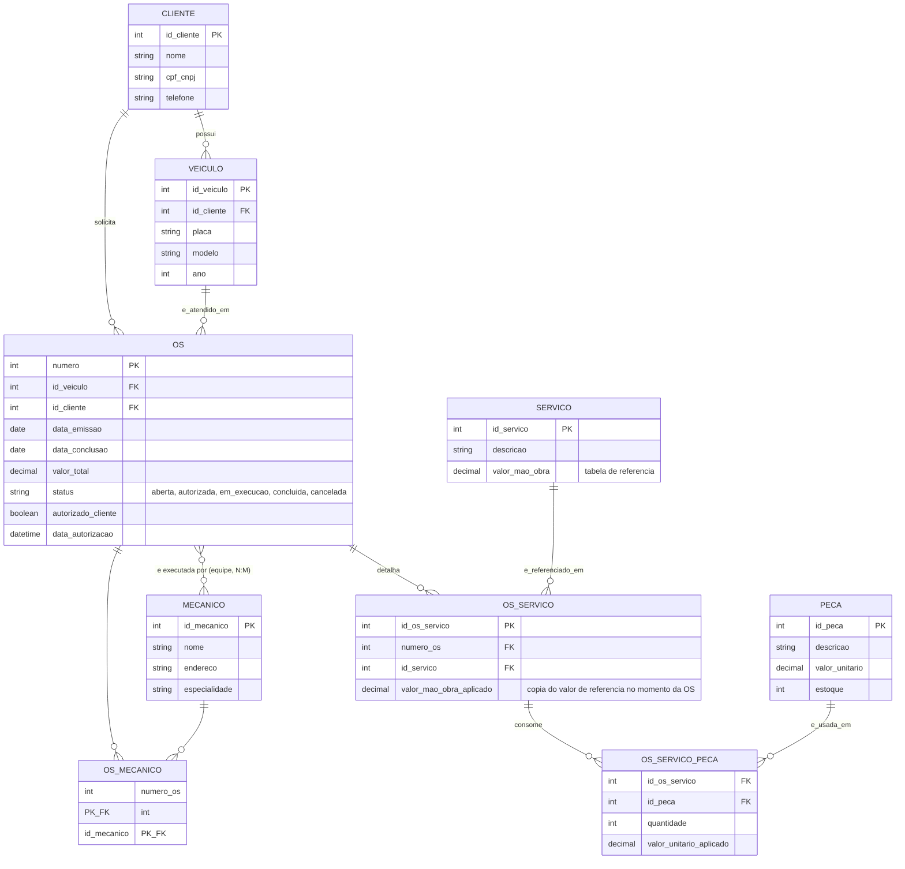

# Desafio 2 — Construindo um Esquema Conceitual para Banco de Dados (Oficina Mecânica)

Desafio de projeto da trilha [Formação SQL Database Specialist](https://web.dio.me/track/1a5a10ed-417c-4fef-8531-2097ff072817) (DIO), módulo *Modelo de Entidade Relacional*.

## Narrativa

Uma oficina mecânica precisa de um sistema para controlar suas ordens de serviço (OS):

- Cada **OS** tem número, data de emissão, valor, status e data de conclusão.
- Um **veículo** do cliente é atendido por uma **equipe de mecânicos** (não um só) — cada mecânico tem código, nome, endereço e especialidade.
- A OS lista os **serviços** executados; cada serviço tem um custo de mão de obra (tabela de referência) e pode consumir **peças**.
- O **cliente** precisa **autorizar** a execução antes do início do serviço.

## Modelo (EER)

## Decisões de modelagem

| Regra de negócio | Decisão |
|---|---|
| Equipe de mecânicos (não um só) atende a OS | Relacionamento **N:M** entre `OS` e `MECANICO`, resolvido com a tabela associativa `OS_MECANICO` (PK composta = as duas FKs) |
| Serviço tem custo de mão de obra de referência, mas o valor cobrado na OS não deve mudar se a tabela de referência mudar depois | `SERVICO.valor_mao_obra` é a tabela de referência; `OS_SERVICO.valor_mao_obra_aplicado` copia esse valor no momento em que o serviço é lançado na OS (histórico imutável) |
| Serviço pode consumir peças (N:M entre serviço-executado-na-OS e peça) | Entidade associativa `OS_SERVICO_PECA`, com PK composta (`id_os_servico`, `id_peca`) e atributo `quantidade` |
| Cliente precisa autorizar antes da execução | `OS.autorizado_cliente` (booleano) + `data_autorizacao`; regra de negócio (bloquear início sem autorização) fica na aplicação/trigger, não no EER |
| Veículo pertence a um cliente, mas a OS referencia os dois | `OS` guarda `id_veiculo` e `id_cliente` como FK — redundante em relação a `VEICULO.id_cliente`, mas intencional: preserva o histórico caso o veículo mude de dono depois da OS ser fechada |

O mapeamento lógico (DDL executável, com seed e queries) está no [Desafio 4](../desafio-4-oficina-logico/).
